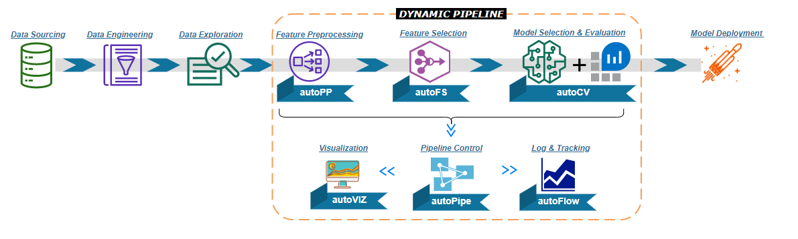

Welcome to Dynamic Pipeline's Documentation!
======================================

   
**Dynamic Pipeline** is a high-level API to help data scientists building models in ensemble way, and automating Machine Learning workflow with simple codes. The core advantage Dynamic Pipeline is it automates general scikit-learn-style pipeline with each component ensembled, and avoids repeated manual cross-experiments with iteration of algrithms combination and searching best parameters. By modularizing all key classic pipeline components in reuseable packages, it allows all components to be custom tunable along with high scalability.

    
.. toctree::
   :maxdepth: 3
   :caption: Contents:

   readme
   installation
   modules
   demos
   authors
   history
   issues
   dynaPreprocessing

Indices and tables
==================
* :ref:`genindex`
* :ref:`modindex`
* :ref:`search`
  
