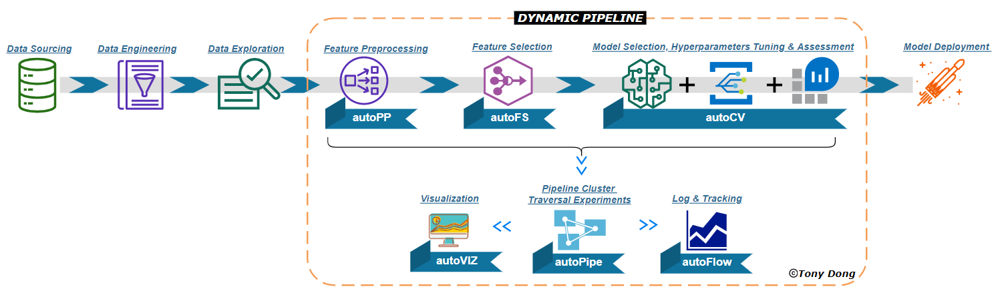
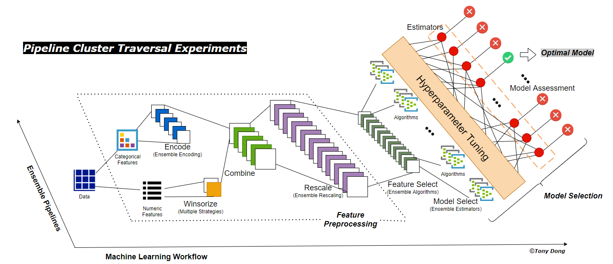

Welcome to OptimalFlow's Documentation!
============================================
.. image:: OptimalFlow_Logo.png
   :width: 200
   :align: center
   
**OptimalFlow** is an Omni-ensemble Automated Machine Learning Python toolkit to help data scientists building optimal models in easy way, and automate Machine Learning workflow with simple code. 

**OptimalFlow** wraps the Scikit-learn supervised learning framework to automatically create a collection of machine learning pipelines(aka ‘pipeline cluster’) based on algorithms permutation in each framework component. It includes feature engineering methods in its preprocessing module such as missing value imputation, categorical feature encoding, numeric feature rescaling, and outlier winsorization. The models  inherit algorithms from Scikit-learn estimators for classification and regression problems.

**OptimalFlow** uses *Pipeline Cluster Traversal Experiments* as the optimizer to build an omni-ensemble workflow for an optimal baseline model searching, including feature preprocessing/selection optimization, hyperparameters tuning, model selection and assessment.

After the version(0.1.10), it added a "no-code" Web App as an application demo built on OptimalFlow. Users could build Automated Machine Learning workflow all by clicks, without any coding at all! (Read more details in 'Web App' https://optimal-flow.readthedocs.io/en/latest/webapp.html)

.. image:: OptimalFlow-WebApp-slow.gif

Comparing other popular "AutoML or Automated Machine Learning" APIs, **OptimalFlow** is designed as an omni-ensemble ML workflow builder with higher-level API targeting to avoid manual repetitive train-along-evaluate experiments in general pipeline building. 

It rebuilt the automated machine learning framework by switching the focus from single pipeline components automation to a higher workflow level by creating an automated ensemble pipelines (Pipeline Cluster) traversal experiments and evaluation mechanisms. In another word, OptimalFlow jumps out of a single pipeline’s scope, while treats the whole pipeline as an entity, and automate produce all possible pipelines for assessment, until finding one of them leads to the optimal model. Thus, when we say a pipeline represents an automated workflow, OptimalFlow is designed to assemble all these workflows, and find the optimal one. That’s also the reason to name it as OptimalFlow.

To achieve that, **OptimalFlow** creates *Pipeline Cluster Traversal Experiments* to assemble all cross-matching pipelines covering major tasks of Machine Learning workflow, and apply traversal-experiment to search the optimal baseline model.
Besides, by modularizing all key pipeline components in reusable packages, it allows all components to be custom tunable along with high scalability.

The core concept/improvement in OptimalFlow is *Pipeline Cluster Traversal Experiments*, which is a theory of framework first proposed by Tony Dong in Genpact 2020 GVector Conference, to optimize and automate Machine Learning Workflow using ensemble pipelines algorithm.
   
Comparing other automated or classic machine learning workflow's repetitive experiments using single pipeline, *Pipeline Cluster Traversal Experiments* is more powerful, with larger coverage scope, to find the best model without manual intervention, and also more flexible with elasticity to cope with unseen data due to its ensemble designs in each component.  

   

In summary, **OptimalFlow** shares a few useful properties for data scientists:

      * *Easy & less coding* - High-level APIs to implement *Pipeline Cluster Traversal Experiments*, and each ML component is highly automated and modularized;

      * *Local-based* - Focus on process automation for locally implementation,which is easy to transfer current operation and meet compliance restriction(i.e. pharmaceutical compliance policy)

      * *Light & transplantable* - Easier to transplant among projects and faster to deployment comparing other cloud-based AutoML solution(i.e. Microsoft Azure AutoML);

      * *Well ensembled* - Each key component is ensemble of popular algorithms w/ optimal hyperparameters tuning included;
      
      * *Omni-Coverage* - Using *Pipeline Cluster Traversal Experiments*, to cross-experiment with combined permutated input datasets, feature selection, and model selection;
      
      * *Scalable* - Each module could add new algorithms easily due to its ensemble and reuseable coding design;

      * *Adaptable* - *Pipeline Cluster Traversal Experiments* makes it easier to adapt unseen datasets with the right pipeline;
      
      * *Custom Modify Welcome* - Support custom settings to add/remove algorithms or modify hyperparameters for elastic requirements.

An End-to-End OptimalFlow Automated Machine Learning Tutorial with Real Projects @ TowardsDataScience:

* Part 1: https://towardsdatascience.com/end-to-end-optimalflow-automated-machine-learning-tutorial-with-real-projects-formula-e-laps-8b57073a7b50

* Part 2: https://towardsdatascience.com/end-to-end-optimalflow-automated-machine-learning-tutorial-with-real-projects-formula-e-laps-31d810539102

Other Stories:

* Ensemble Feature Selection in Machine Learning using OptimalFlow - Easy Way with Simple Code to Select top Features: https://towardsdatascience.com/ensemble-feature-selection-in-machine-learning-by-optimalflow-49f6ee0d52eb

* Ensemble Model Selection & Evaluation in Machine Learning using OptimalFlow - Easy Way with Simple Code to Select the Optimal Model: https://towardsdatascience.com/ensemble-model-selection-evaluation-in-machine-learning-by-optimalflow-9e5126308f12

* Build No-code Automated Machine Learning Model with OptimalFlow Web App: https://towardsdatascience.com/build-no-code-automated-machine-learning-model-with-optimalflow-web-app-8acaad8262b1

**Table of contents**

.. toctree::
   :maxdepth: 3

   installation
   webapp
   autoPP
   autoFS
   autoCV
   autoPipe
   autoViz
   autoFlow
   demos
   authors
   history
   issues

Indices and tables
==================
* :ref:`genindex`
* :ref:`modindex`
* :ref:`search`
  
