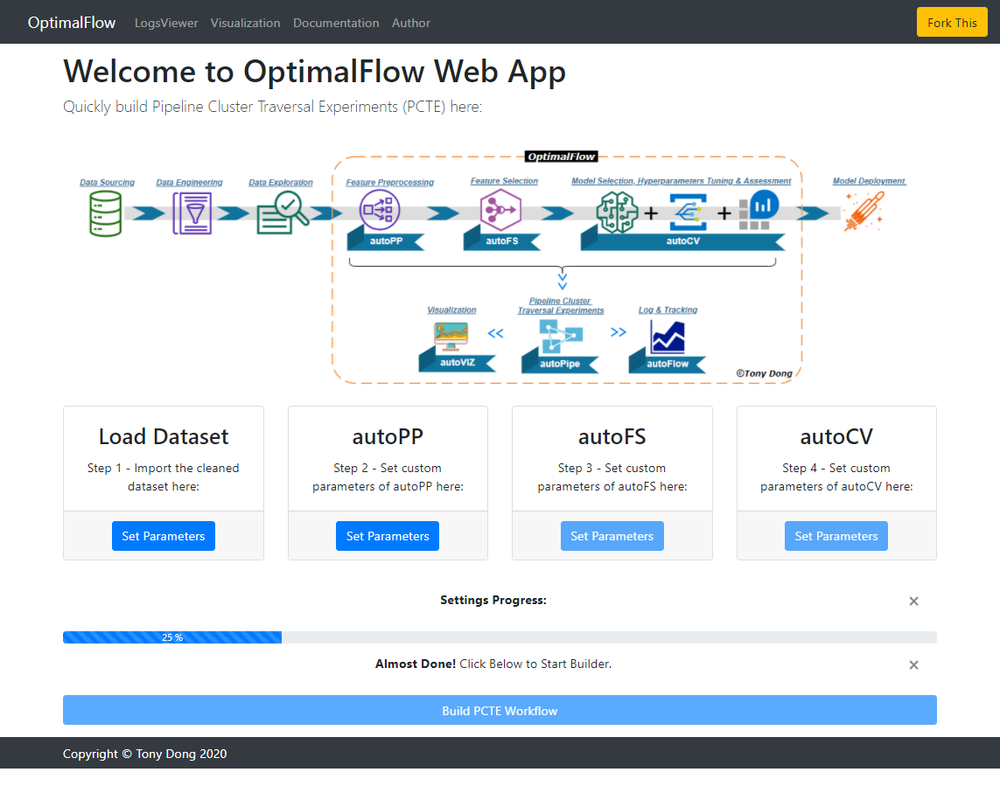
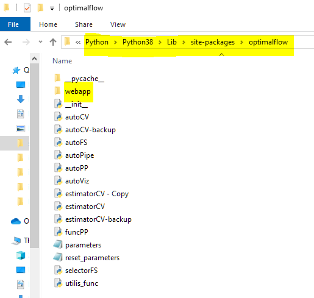
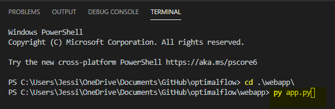
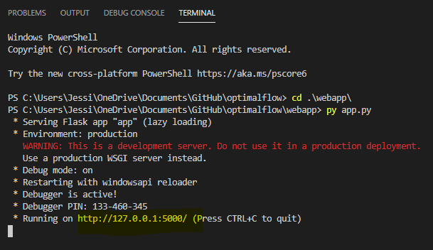
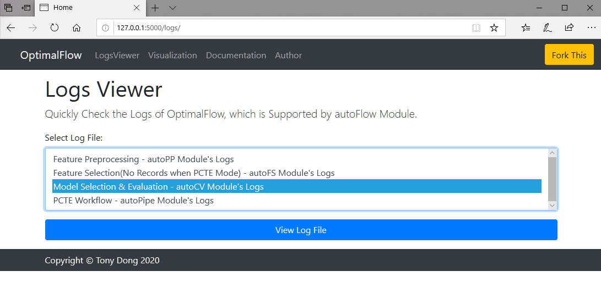

========
Web App 
========

About OptimalFlow Web App:
---------------------------
OptimalFlow was designed highly modularized from the beginning, which made it easy to continue developing and users could build applications based on it. The web app of OptimalFlow is a user-friendly GUI for people who don't have coding experience to build Omni-ensemble Automated Machine Learning workflow easily and quickly.

The Web App currently includes 3 function components: Pipeline Cluster Traversal Experiment(PCTE) Builder, LogsViewer, and Visualization. Users can set up the parameters for each OptimalFlow's key module, and run the workflow all by clicking on the web page. Also, when the automated machine learning process(PCTE) has done, users could check logs information and review the visualization outputs immediately.

Comparing other popular 'no-code' machine learning platforms, the Web App is born from OptimalFlow's unique Omni-ensemble Automated Machine Learning framework and built on Pipeline Cluster Traversal Experiments(PCTE) theory. It's also light, scalable, and open-source to users. It was designed for data scientists who need more focus on local implementation and can be easily transplanted among machines. When the data science team wants to deploy it on a server, Flask based Web App can be quickly implemented with high flexibility.

In summary, the goal of this web application is: Build Automated Machine Learning Workflow without Code!

How to deploy Web App:
------------------
* **Step 1: Install OptimalFlow:** 
If you didn't install OptimalFlow's latest version, you should do that from PYPI, simply using PIP.
To install OptimalFlow's latest version, run this command in your terminal:
.. code-block:: console

    $ pip install --upgrade optimalflow

* **Step 2: Download web app's source code:**
There're 2 ways to download its source code:

Method 1 - Get it from OptimalFlow GitHub<https://github.com/tonyleidong/OptimalFlow/tree/master/optimalflow>. Download all codes and sub-folders within 'Webapp' folder.
    

.. image:: webapp-deployment-0.PNG
   :width: 500

Method 2 - Get from OptimalFlow's package. You could find it in you Python core folder. Here's the example where you can find the 'Webapp' folder.

* **Step 3: Start a server port:**
Move the downloaded 'Webapp' folder to the place you want to store it. Using your Terminal or Prompt enter its directory, and run the **app.py** (ignore 'py' here when you are not playing it in VS Code)

And you will see the output similar to the picture below:

Done! You can now open your browser (recommend Chrome), and type 127.0.0.1:500 to open the web app in your laptop.

Build Pipeline Cluster Traversal Experiment(PCTE) Workflow:
-----------------------------------------------------------

When you done the deployment steps, and start running the server, you will see the web app in your browser like picture below:

To build a PCTE workflow, you need to enter the parameters for each OptimalFlow's module: autoPP, autoFS and autoCV.

But before that, you need to move the dataset you want to build model into the ./input folder. You will see a sample dataset called "breast-cancer.csv" there.

After doing that, we could select the dataset by clicking the button under "Load Dataset":

.. image:: webapp-pcte-load-data.PNG
   :width: 500

Then, you need to finish the settings for autoPP, autoFS, and autoCV step by step. Please note, be careful to the setting "sparsity" and "cols" values in autoPP parameters panel, if the combinaton of the feature preprocessing can't meet the restriction values you've set, OptimalFlow will not able to continue running the following modules. More details could be found in autoPP's documentation<https://optimal-flow.readthedocs.io/en/latest/autoPP.html>

.. image:: webapp-pcte-set-autoPP.PNG
   :width: 500

.. image:: webapp-pcte-set-autoFS.PNG
   :width: 500

.. image:: webapp-pcte-set-autoCV.PNG
   :width: 500

Finally, when you finished all setting steps(the progress bar is fulfilled), you can click the 'Build PCTE Workflow' button, to run the Omni-ensemble Automated Machine Learning based on PCTE algorithm.

.. image:: webapp-pcte-start-run.PNG
   :width: 500

Here's the sample outputs when the process's done.

.. image:: webapp-pcte-end-run.PNG
   :width: 500

LogsViewer:
-------------
You could view the logs information related to each module in 'LogsViewer' page. Please note, you could only use it after the previous automated machine learning process's done. 

Visualization:
--------------

You could also review the visualization outputs from 'Visualization' page. For classification problem, it will present 'Pipeline Cluster Traversal Experiments Model Retrieval Diagram' and 'Pipeline Cluster Model Evaluation Dynamic Table'. And for regression problem, it only will present 'Pipeline Cluster Model Evaluation Dynamic Table'. All visualizaton outputs are based on plotly, so you could play with them by dragging or scrolling. You will find more detais in example page<https://optimal-flow.readthedocs.io/en/latest/demos.html#pipeline-cluster-traversal-experiments-model-retrieval-diagram-using-autoviz>.

.. image:: webapp-Visualization.PNG
   :width: 500
